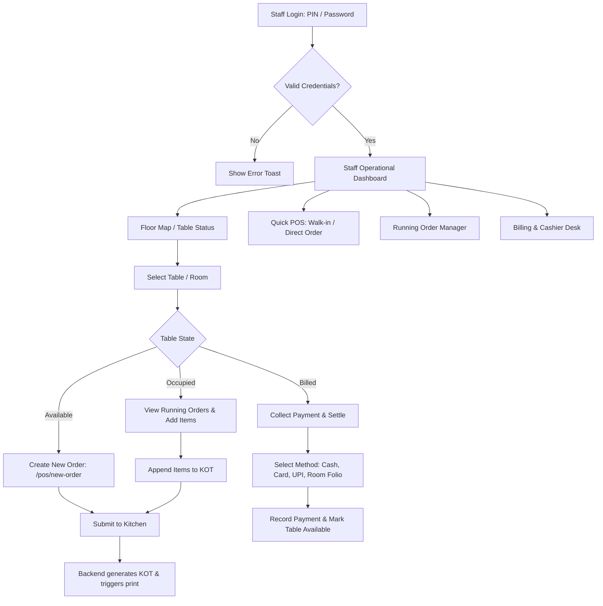
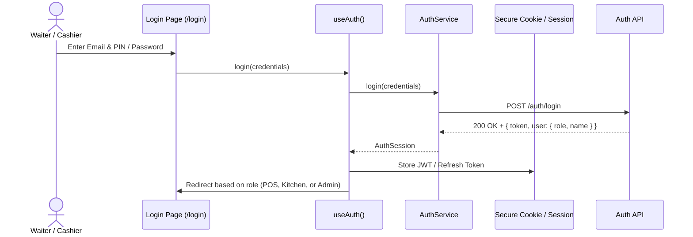

# Staff POS & Table Management Flow

## 1. End-to-End Staff Workflow

```mermaid
flowchart TD
    Login[Staff Login: PIN / Password] --> AuthCheck{Valid Credentials?}
    AuthCheck -->|No| LoginError[Show Error Toast]
    AuthCheck -->|Yes| Dashboard[Staff Operational Dashboard]

    Dashboard --> Tables[Floor Map / Table Status]
    Dashboard --> QuickPOS[Quick POS: Walk-in / Direct Order]
    Dashboard --> OrderList[Running Order Manager]
    Dashboard --> BillingDesk[Billing & Cashier Desk]

    Tables --> SelectTable[Select Table / Room]
    SelectTable --> TableAction{Table State}

    TableAction -->|Available| NewOrder[Create New Order: /pos/new-order]
    TableAction -->|Occupied| ViewRunning[View Running Orders & Add Items]
    TableAction -->|Billed| SettleBill[Collect Payment & Settle]

    NewOrder --> SubmitOrder[Submit to Kitchen]
    SubmitOrder --> AutoKOT[Backend generates KOT & triggers print]

    ViewRunning --> AddMore[Append Items to KOT]
    AddMore --> SubmitOrder

    SettleBill --> PaymentSelection[Select Method: Cash, Card, UPI, Room Folio]
    PaymentSelection --> RecordSettlement[Record Payment & Mark Table Available]
```

---

## 2. Staff Authentication & Session Lifecycle

```mermaid
sequenceDiagram
    actor Staff as Waiter / Cashier
    participant UI as Login Page (/login)
    participant Hook as useAuth()
    participant Service as AuthService
    participant Storage as Secure Cookie / Session
    participant Server as Auth API

    Staff->>UI: Enter Email & PIN / Password
    UI->>Hook: login(credentials)
    Hook->>Service: login(credentials)
    Service->>Server: POST /auth/login
    Server-->>Service: 200 OK + { token, user: { role, name } }
    Service-->>Hook: AuthSession
    Hook->>Storage: Store JWT / Refresh Token
    Hook->>UI: Redirect based on role (POS, Kitchen, or Admin)
```
